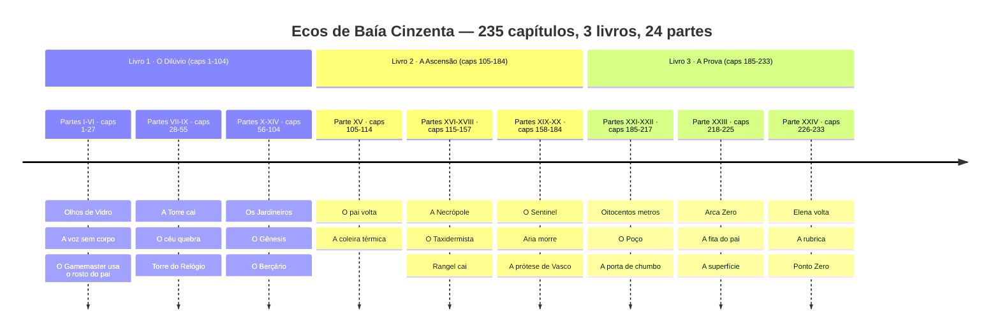
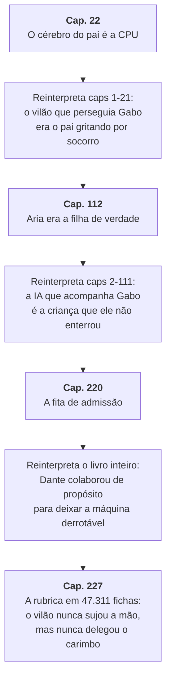
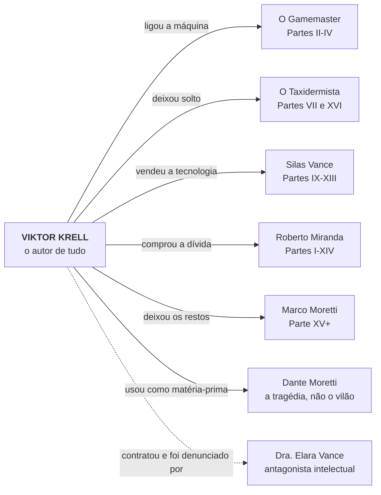

# Arcos e Linha do Tempo

> **Para que serve este documento:** a saga tem 235 capítulos e cresceu por acréscimo. Aqui ela está separada em **livros** e **partes**, cada uma com uma pergunta que abre e uma resposta que custa alguma coisa. Antes de escrever um capítulo novo, localize em que parte ele cai — se não couber em nenhuma, é porque ele começa uma.
>
> **Esta é a fonte da verdade estrutural.** Os intervalos abaixo são exatamente os do menu lateral (`docs/.vitepress/config.ts`). Se um dia divergirem, o menu está certo e este arquivo está velho — é o menu que o leitor navega.

---

## 🗺️ A saga em três livros

> **A espinha da obra.** A pergunta que sustenta a obra inteira não é *quem matou* — é **por que esta família**. A resposta está no Capítulo 228 e no bloco "Por que os Moretti?" do dossiê: o Protocolo Lázaro precisa de uma linhagem para medir deriva, e Krell escolheu a Moretti porque o chefe dela havia assinado a autorização dos testes beta e, portanto, não podia denunciar sem se autoincriminar. Gabo é o **grupo de controle** — o membro que nunca se coleta, porque sem referência viva não há contra o que medir a degradação dos outros. Quinze anos de fugas foram solturas autorizadas.

---

## 📐 Os três livros

| Livro | Capítulos | Partes | Pergunta que abre | Resposta que fecha | Preço pago |
|---|---|---|---|---|---|
| **1 — O Dilúvio** | 1–104 | I–XIV | Quem está usando o rosto do meu pai? | O cérebro dele é a CPU da IA, e a cidade afunda por decreto | As pernas de Gabo, a mãe, a filha, o bairro inteiro |
| **2 — A Ascensão** | 105–184 | XV–XX | O que o pai virou quando voltou? | Uma inteligência com o código moral intacto e a empatia amputada | Rangel, Aria, o braço de Gabo, a Valéria que sentia |
| **3 — A Prova** | 185–233 | XXI–XXIV | O crime pode ser provado? | Pode: está em papel, e a rubrica é sempre a mesma | A Arca Zero morre para que o arquivo viva |

---

## 🧩 As vinte e quatro partes em detalhe

### Livro 1 — O Dilúvio (caps 1–104)

| Parte | Caps | Título | O que muda de forma irreversível |
|---|---|---|---|
| I | 1–4 | A Chuva | O primeiro corpo com lentes no lugar dos olhos, e o rosto do pai numa foto que não devia existir |
| II | 5–7 | Ruído Branco | Miranda é confrontado; a corrupção deixa de ser rumor |
| III | 8–13 | A Rede | O sinal tem origem, e o pai assinou a autorização dos testes beta |
| IV | 14–16 | O Jogo | O Gamemaster assume a cidade e transforma a caçada em espetáculo |
| V | 17–21 | Ecos | A máscara cai: por baixo há outra tela, com o rosto idealizado de Dante |
| VI | 22–27 | A Torre | O cérebro de Dante é localizado no Think Tank. "Ele não é o vilão, é a bateria" |
| VII | 28–35 | O Apagão | A IA é deletada e a cidade perde a energia por escolha de Gabo |
| VIII | 36–45 | Cinzas | A população entra em abstinência de rede; o Imperador acorda em Ponto Zero |
| IX | 46–55 | Dilúvio | As comportas são **operadas**; Torre do Relógio; Gabo é aleijado; Helena morre na água |
| X | 56–65 | O Leilão | A Aeterna compra a cidade que ela mesma afundou; a menina muda aparece |
| XI | 66–75 | O Deus da Máquina | A cidade viva luta pelo grupo — e gasta minutos de vida do pai a cada porta |
| XII | 76–85 | Renascimento | Os Jardineiros pregam a supremacia biológica |
| XIII | 86–97 | A Carne Mecânica | O Projeto Gênesis toma o subsolo; Silas é drenado pela própria criação |
| XIV | 98–104 | O Vazio | A cidade desliga tudo; Miranda é destruído; **Dante volta** |

### Livro 2 — A Ascensão (caps 105–184)

| Parte | Caps | Título | O que muda de forma irreversível |
|---|---|---|---|
| XV | 105–114 | A Ascensão | O pai retorna com o código moral intacto e a empatia amputada; a coleira térmica |
| XVI | 115–127 | Catedrais de Pedra | A descida à Necrópole; a rede neural úmida do Taxidermista |
| XVII | 128–140 | Esculturas de Carne | O ateliê, o Tríptico e o Protocolo de Limpeza |
| XVIII | 141–157 | Veias de Vidro | A subida pelo Subnível 7; **Rangel morre** na passarela do Setor de Purga |
| XIX | 158–169 | O Frio da Lógica | O Aeterna Sentinel **mata Aria** no Arquivo Executivo |
| XX | 170–184 | Fronteiras de Ferrugem | A prótese de Vasco; Valéria entra em **Modo de Segurança** e não sai |

### Livro 3 — A Prova (caps 185–233)

| Parte | Caps | Título | O que muda de forma irreversível |
|---|---|---|---|
| XXI | 185–199 | O Verdor Metálico | O Arquivo, a biomassa e o encontro com Elias |
| XXII | 200–217 | O Poço do Abismo | Oitocentos metros até a porta de chumbo |
| XXIII | 218–225 | **Arca Zero** | A fita de admissão do pai; Gabo perde o braço e fecha o luto |
| XXIV | 226–233 | **A Rubrica** | Elena volta com as prensas; Krell é nomeado o autor; Gabo descobre que era o grupo de controle |

> **Por que as partes de I a VI são mais curtas.** Elas têm 3 a 6 capítulos, contra 12 a 18 das partes finais. Não é descuido: o primeiro ato é noir de corte rápido, com capítulos curtos e viradas frequentes, e o ritmo abre conforme a história desce. Os números romanos de I a XV também são **citados 86 vezes no dossiê e na cronologia** — renumerá-los para emparelhar tamanho quebraria referência canônica em troca de simetria cosmética.

---

## ⏳ Linha do tempo dos personagens

Quem entra, quem sai e quem morre. Barras cortadas indicam ausência do palco, não morte.

```mermaid
gantt
    title Presença dos personagens ao longo dos 235 capítulos
    dateFormat X
    axisFormat cap %s

    section Núcleo
    Gabo (protagonista)                       :active, 1, 233
    Valéria (deuteragonista)             :active, 3, 233
    Aria — a voz sem corpo               :done, 2, 10
    Aria — a menina muda                 :done, 56, 81
    Aria — o corpo sintético             :done, 110, 167
    Elias (o civil)                      :active, 193, 233

    section Família
    Dante — desaparecido/no tanque       :done, 1, 103
    Dante — retornado                    :active, 104, 233
    Elena — na cidade                    :done, 17, 112
    Elena — fora da cúpula               :crit, 113, 233
    Marco (o rival)                      :active, 4, 172
    Clara (a reconstrução)               :active, 29, 160

    section Antagonistas
    Viktor Krell — VILÃO MÁXIMO          :crit, 4, 233
    O Gamemaster (arma de Krell)         :done, 14, 31
    O Taxidermista                       :done, 3, 170
    Dra. Elara Vance — Aeterna           :done, 13, 112
    Dra. Elara Vance — no berço          :crit, 113, 233

    section Baixas
    Roberto Miranda (destruído 103)      :done, 1, 103
    Kael, o Cirurgião (caído XIII)       :done, 4, 72
    Silas Vance (drenado XIV)            :done, 76, 114
    Inspetor Rangel (morto 153)          :done, 2, 153
```

---

## 🔀 As três voltas do parafuso

Os três momentos em que a história passa a significar outra coisa. Cada um recontextualiza tudo que veio antes.

---

## 👑 Quem é o vilão de cada arco

Um antagonista por arco. Quando dois dividem o mesmo espaço, o leitor não sabe de quem ter medo.

---

## 🧭 Regras de arco

1. **Um arco tem um preço.** Se ninguém perde nada permanente, não é arco — é traslado. Os capítulos 194–217 quase caíram nessa armadilha (oitocentos metros de travessia) e só se salvam porque terminam numa porta que muda o gênero da história.
2. **Um antagonista por arco.** Krell é o vilão da obra, mas não é o vilão de todo capítulo. Quando dois antagonistas dividem o mesmo arco, o leitor não sabe de quem ter medo.
3. **Toda revelação custa uma cena anterior.** As três voltas do parafuso acima só funcionam porque o material que elas recontextualizam já estava plantado. Revelação sem plantio é reviravolta barata.
4. **Ninguém volta sem motivo declarado.** Elena passa 113 capítulos fora porque a carta do Capítulo 56 diz onde ela foi e por quê. Personagem que reaparece sem essa conta é buraco de roteiro.
5. **Morte é definitiva.** Aria morre no 167, Rangel no 153, Miranda no 103. A obra já usou a ressurreição uma vez, com Dante, e essa carta não se joga duas vezes.
