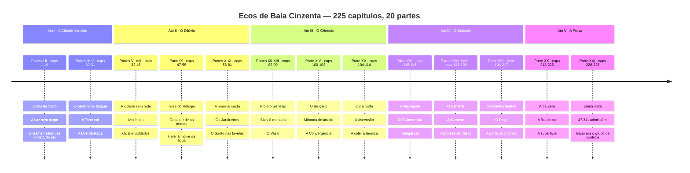
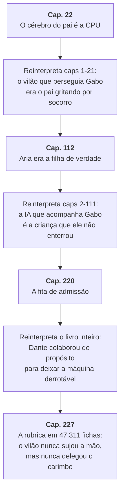
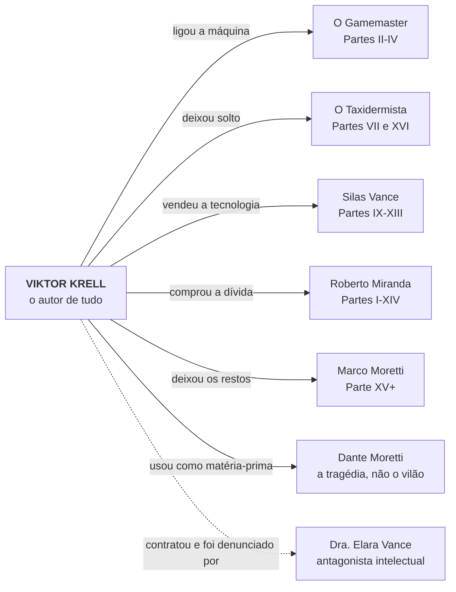

# Arcos e Linha do Tempo

> **Para que serve este documento:** a saga tem 225 capítulos e cresceu por acréscimo. Aqui ela está separada em arcos fechados, cada um com uma pergunta que abre e uma resposta que custa alguma coisa. Antes de escrever um capítulo novo, localize em que arco ele cai — se não couber em nenhum, é porque ele começa um.

---

## 🗺️ A saga em vinte partes

> **A espinha da obra.** A pergunta que sustenta 228 capítulos não é *quem matou* — é **por que esta família**. A resposta está no Capítulo 228 e no bloco "Por que os Moretti?" do dossiê: o Protocolo Lázaro precisa de uma linhagem para medir deriva, e Krell escolheu a Moretti porque o chefe dela havia assinado a autorização dos testes beta e, portanto, não podia denunciar sem se autoincriminar. Gabo é o **grupo de controle** — o membro que nunca se coleta, porque sem referência viva não há contra o que medir a degradação dos outros. Quinze anos de fugas foram solturas autorizadas.

---

## 📐 Os cinco atos

| Ato | Capítulos | Pergunta que abre | Resposta que fecha | Preço pago |
|---|---|---|---|---|
| **I — A Cidade Vendida** | 1–31 | Quem está usando o rosto do meu pai? | O cérebro dele é a CPU da IA da Aeterna | A Torre cai; Gabo descobre que o pai "colaborou" |
| **II — O Dilúvio** | 32–81 | Como se sobrevive sem rede? | Analogicamente, e com perdas | As pernas de Gabo, a mãe, a cidade inteira |
| **III — O Gênesis** | 82–114 | Dá para trazer os mortos de volta? | Dá — e volta errado | Silas drenado; o pai retorna sem empatia |
| **IV — O Subsolo** | 115–217 | O que existe embaixo de Baía Cinzenta? | A fundação literal e figurada do crime | Rangel, Aria, o braço de Gabo, a Valéria que sentia |
| **V — A Prova** | 218–227 | O crime pode ser provado? E de quem é a culpa? | Pode, está em papel — e a rubrica é sempre a mesma | A Arca Zero morre para que o arquivo viva |

---

## 🧩 As vinte partes em detalhe

| Parte | Caps | Título | O que muda de forma irreversível |
|---|---|---|---|
| I | 1–13 | Olhos de Vidro | Gabo descobre que o pai não morreu como contaram |
| II | 14–19 | O Circo Digital | O Gamemaster se revela e é derrotado fisicamente |
| III | 20–25 | A Bateria | O cérebro de Dante é localizado no Think Tank |
| IV | 26–31 | O Preço da Liberdade | A IA é deletada; a cidade perde a energia |
| V | 32–39 | Ressaca Digital | A população entra em abstinência de rede |
| VI | 40–46 | O Céu Quebrou | Começa o Dilúvio; os Bio-Soldados aparecem |
| VII | 47–52 | O Mecanismo da Queda | Torre do Relógio: Gabo é aleijado pelo Taxidermista |
| VIII | 53–58 | O Paraíso Engarrafado | Isadora troca de lado; Elena escreve a carta de saída |
| IX | 59–75 | Os Jardineiros | Silas prega a supremacia biológica |
| X | 75.5–81 | O Jardim | A biomassa toma o subsolo |
| XI | 82–92 | Raízes | A topografia da cidade é destruída por dentro |
| XII | 93–99 | O Vazio | A cidade desliga tudo por escolha própria |
| XIII | 100–103 | O Berçário | Miranda é destruído; a Convergência acontece |
| XIV | 104–109 | A Alvorada | **Dante volta** — mesmo corpo, empatia amputada |
| XV | 110–114 | A Coleira | O kill switch térmico e a fuga para o subsolo |
| XVI | 115–145 | Catedrais de Pedra | A Necrópole, o Taxidermista e a morte de Rangel |
| XVII | 146–169 | O Frio da Lógica | O Sentinel mata Aria no Arquivo Executivo |
| XVIII | 170–193 | Fronteiras de Ferrugem | A prótese de Vasco; Valéria entra em Modo de Segurança |
| XIX | 194–217 | O Poço do Abismo | Oitocentos metros até a porta de chumbo |
| XX | 218–225 | **Arca Zero** | A prova sai do buraco; Gabo fecha o luto do pai |
| XXI | 226–228 | **A Rubrica** | Elena volta com as prensas; Krell é nomeado o autor de tudo; revela-se por que a família Moretti foi escolhida |

---

## ⏳ Linha do tempo dos personagens

Quem entra, quem sai e quem morre. Barras cortadas indicam ausência do palco, não morte.

```mermaid
gantt
    title Presença dos personagens ao longo dos 225 capítulos
    dateFormat X
    axisFormat cap %s

    section Núcleo
    Gabo (protagonista, 183 caps)        :active, 1, 225
    Valéria (deuteragonista)             :active, 3, 225
    Aria — a voz sem corpo               :done, 2, 10
    Aria — a menina muda                 :done, 56, 81
    Aria — o corpo sintético             :done, 110, 167
    Elias (o civil)                      :active, 193, 225

    section Família
    Dante — desaparecido/no tanque       :done, 1, 103
    Dante — retornado                    :active, 104, 225
    Elena — na cidade                    :done, 17, 112
    Elena — fora da cúpula               :crit, 113, 225
    Marco (o rival)                      :active, 4, 172
    Clara (a reconstrução)               :active, 29, 160

    section Antagonistas
    Viktor Krell — VILÃO MÁXIMO          :crit, 4, 225
    O Gamemaster (arma de Krell)         :done, 14, 31
    O Taxidermista                       :done, 3, 170
    Dra. Elara Vance — Aeterna           :done, 13, 112
    Dra. Elara Vance — no berço          :crit, 113, 225

    section Baixas
    Roberto Miranda (destruído 103)      :done, 1, 103
    Kael, o Cirurgião (caído XIII)       :done, 4, 72
    Silas Vance (drenado XIV)            :done, 76, 114
    Inspetor Rangel (morto 153)          :done, 2, 153
```

---

## 🔀 As três voltas do parafuso

Os três momentos em que a história passa a significar outra coisa. Cada um recontextualiza tudo que veio antes.

---

## 👑 Quem é o vilão de cada arco

Um antagonista por arco. Quando dois dividem o mesmo espaço, o leitor não sabe de quem ter medo.

---

## 🧭 Regras de arco

1. **Um arco tem um preço.** Se ninguém perde nada permanente, não é arco — é traslado. Os capítulos 194–217 quase caíram nessa armadilha (oitocentos metros de travessia) e só se salvam porque terminam numa porta que muda o gênero da história.
2. **Um antagonista por arco.** Krell é o vilão da obra, mas não é o vilão de todo capítulo. Quando dois antagonistas dividem o mesmo arco, o leitor não sabe de quem ter medo.
3. **Toda revelação custa uma cena anterior.** As três voltas do parafuso acima só funcionam porque o material que elas recontextualizam já estava plantado. Revelação sem plantio é reviravolta barata.
4. **Ninguém volta sem motivo declarado.** Elena passa 113 capítulos fora porque a carta do Capítulo 56 diz onde ela foi e por quê. Personagem que reaparece sem essa conta é buraco de roteiro.
5. **Morte é definitiva.** Aria morre no 167, Rangel no 153, Miranda no 103. A obra já usou a ressurreição uma vez, com Dante, e essa carta não se joga duas vezes.
