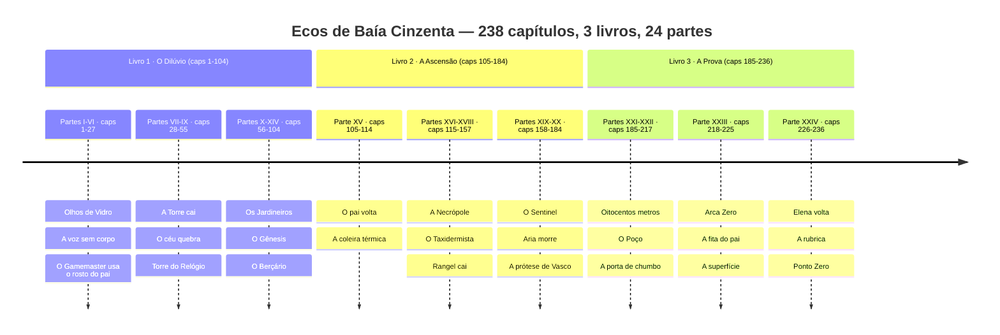
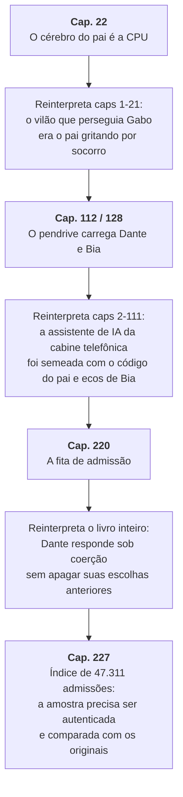
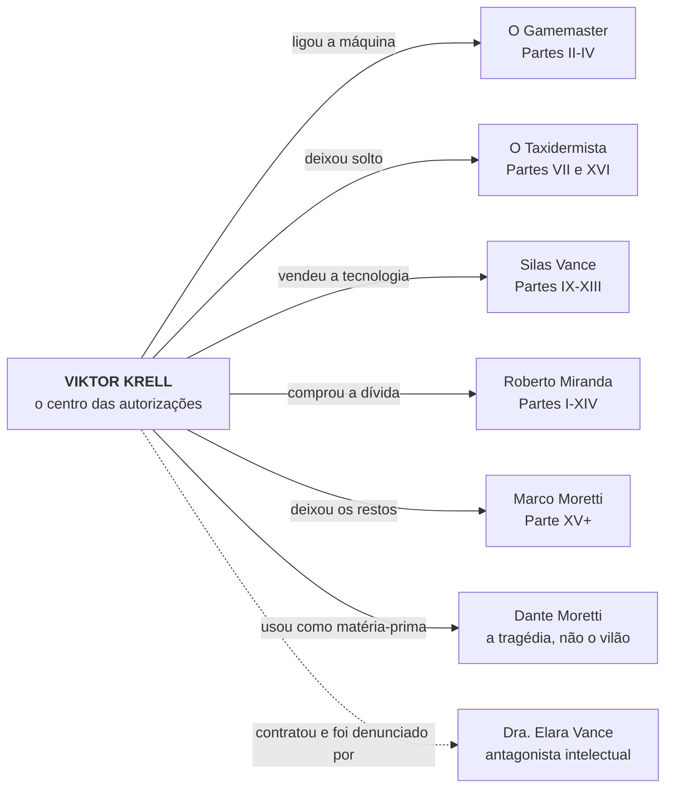

# Arcos e Linha do Tempo

> **Para que serve este documento:** a saga tem 238 capítulos e cresceu por acréscimo. Aqui ela está separada em **livros** e **partes**, cada uma com uma pergunta que abre e uma resposta que custa alguma coisa. Antes de escrever um capítulo novo, localize em que parte ele cai — se não couber em nenhuma, é porque ele começa uma.
>
> **Esta é a fonte da verdade estrutural.** Os intervalos abaixo são exatamente os do menu lateral (`docs/.vitepress/config.ts`). Se um dia divergirem, o menu está certo e este arquivo está velho — é o menu que o leitor navega.

## 🗺️ A saga em três livros

```mermaid
timeline
    title Ecos de Baía Cinzenta — 238 capítulos, 3 livros, 24 partes
    section Livro 1 · O Dilúvio (caps 1-104)
        Partes I-VI · caps 1-27 : Olhos de Vidro : A voz sem corpo : O Gamemaster usa o rosto do pai
        Partes VII-IX · caps 28-55 : A Torre cai : O céu quebra : Torre do Relógio
        Partes X-XIV · caps 56-104 : Os Jardineiros : O Gênesis : O Berçário
    section Livro 2 · A Ascensão (caps 105-184)
        Parte XV · caps 105-114 : O pai volta : A coleira térmica
        Partes XVI-XVIII · caps 115-157 : A Necrópole : O Taxidermista : Rangel cai
        Partes XIX-XX · caps 158-184 : O Sentinel : Aria morre : A prótese de Vasco
    section Livro 3 · A Prova (caps 185-236)
        Partes XXI-XXII · caps 185-217 : Oitocentos metros : O Poço : A porta de chumbo
        Parte XXIII · caps 218-225 : Arca Zero : A fita do pai : A superfície
        Parte XXIV · caps 226-236 : Elena volta : A rubrica : Ponto Zero
```

> **A espinha da obra.** A pergunta que sustenta a obra inteira não é *quem matou* — é **por que esta família**. A resposta está no Capítulo 228 e no bloco "Por que os Moretti?" do dossiê: o Protocolo Lázaro escolheu uma linhagem para medir deriva, e Krell selecionou a Moretti porque o chefe dela havia assinado a autorização dos testes beta e poderia se autoincriminar ao denunciá-los. O arquivo classifica Gabo como **grupo de controle** e registra vigilância desde 2035; não comprova a hipótese científica do estudo nem que o protocolo tenha comandado suas fugas.

## 📐 Os três livros

| Livro | Capítulos | Partes | Pergunta que abre | Resposta que fecha | Preço pago |
| --- | --- | --- | --- | --- | --- |
| **1 — O Dilúvio** | 1–104 | I–XIV | Quem está usando o rosto do meu pai? | O cérebro dele é a CPU da IA, e a cidade afunda por decreto | As pernas de Gabo, a mãe, a rede e o bairro inteiro |
| **2 — A Ascensão** | 105–184 | XV–XX | O que o pai virou quando voltou? | Uma inteligência com o código moral intacto e a empatia amputada | Rangel, o pendrive de Aria, o uso do braço direito de Gabo, a estabilidade afetiva de Val |
| **3 — A Prova** | 185–236 | XXI–XXIV | O crime pode ser provado? | Pode: está em papel, e o índice e a amostra apontam a mesma rubrica | A Arca Zero morre para que o arquivo viva |

## 🧩 As vinte e quatro partes em detalhe

### Livro 1 — O Dilúvio (caps 1–104)

| Parte | Caps | Título | O que muda de forma irreversível |
| --- | --- | --- | --- |
| I | 1–4 | A Chuva | O primeiro corpo com lentes no lugar dos olhos, e a assistente de IA Aria encontrada num pendrive na cabine telefônica |
| II | 5–7 | Ruído Branco | Miranda é confrontado; a corrupção deixa de ser rumor |
| III | 8–13 | A Rede | O sinal tem origem, e o pai assinou a autorização dos testes beta |
| IV | 14–16 | O Jogo | O Gamemaster assume a cidade e transforma a caçada em espetáculo |
| V | 17–21 | Ecos | A máscara cai: por baixo há outra tela, com o rosto idealizado de Dante |
| VI | 22–27 | A Torre | O cérebro de Dante é localizado no Think Tank. "Ele não é o vilão, é a bateria" |
| VII | 28–35 | O Apagão | A IA é deletada e a cidade perde a energia por escolha de Gabo |
| VIII | 36–45 | Cinzas | A população entra em abstinência de rede; o Imperador acorda em Ponto Zero |
| IX | 46–55 | Dilúvio | As comportas são **operadas**; Torre do Relógio; lesões de Gabo são agravadas; Helena morre sem acesso a atendimento |
| X | 56–65 | O Leilão | A Aeterna compra a cidade que ela mesma afundou; o Consórcio caça o pendrive de Aria |
| XI | 66–75 | O Deus da Máquina | O pendrive de Aria liga-se ao backup de Dante — e gasta minutos de vida do pai a cada porta |
| XII | 76–85 | Renascimento | Os Jardineiros pregam a supremacia biológica |
| XIII | 86–97 | A Carne Mecânica | O Projeto Gênesis toma o subsolo; o Código Morto no pendrive de Aria destrói a Colmeia |
| XIV | 98–104 | O Vazio | A cidade desliga tudo; Miranda é destruído; **Dante volta** |

### Livro 2 — A Ascensão (caps 105–184)

| Parte | Caps | Título | O que muda de forma irreversível |
| --- | --- | --- | --- |
| XV | 105–114 | A Ascensão | O pai retorna com o código moral intacto e a empatia amputada; a coleira térmica |
| XVI | 115–127 | Catedrais de Pedra | A descida à Necrópole; o pendrive de Aria sofre sobrecarga e é reparado no Fliperama |
| XVII | 128–140 | Esculturas de Carne | O glitch de Bia Vargas no pendrive, o hard reboot de Aria e o Protocolo de Limpeza |
| XVIII | 141–157 | Veias de Vidro | A subida pelo Subnível 7; **Rangel morre** na passarela do Setor de Purga |
| XIX | 158–169 | O Frio da Lógica | O Aeterna Sentinel **funde o pendrive de Aria** no terminal do Arquivo Executivo |
| XX | 170–184 | Fronteiras de Ferrugem | A prótese de Vasco; Valéria entra em **Modo de Segurança instável** — o corte cai e volta, com lapsos de afeto, até estabilizar no cap. 221 |

### Livro 3 — A Prova (caps 185–236)

| Parte | Caps | Título | O que muda de forma irreversível |
| --- | --- | --- | --- |
| XXI | 185–199 | O Verdor Metálico | O Arquivo, a biomassa e o encontro com Elias |
| XXII | 200–217 | O Poço do Abismo | Oitocentos metros até a porta de chumbo |
| XXIII | 218–225 | **Arca Zero** | A fita de admissão do pai; Gabo deixa a armação externa, preserva o braço fraturado e enfrenta o luto |
| XXIV | 226–236 | **A Rubrica** | Elena volta com as prensas; Krell é exposto; Elena destrói a subestação da Aeterna e morre heroicamente; a fita cassete e o enterro |

## ⏳ Linha do tempo dos personagens

Quem entra, quem sai e quem morre. Barras cortadas indicam ausência do palco, não morte.

```mermaid
gantt
    title Presença dos personagens ao longo dos 238 capítulos
    dateFormat X
    axisFormat cap %s
    section Núcleo
    Gabo (protagonista)                       :active, 1, 236
    Valéria (deuteragonista)             :active, 3, 236
    Aria — no pendrive (fase inicial)    :done, 2, 10
    Aria — no pendrive (Consórcio/Rede)  :done, 56, 96
    Aria — no pendrive (Glitch e Reboot) :done, 109, 167
    Elias (o civil)                      :active, 193, 236

    section Família
    Dante — desaparecido/no tanque       :done, 1, 27
    Bio-Dante — cópia                    :active, 104, 236
    Elena — na cidade                    :done, 17, 112
    Elena — fora da cúpula               :crit, 113, 225
    Marco (o rival)                      :active, 4, 172
    Clara (a reconstrução)               :active, 29, 160

    section Antagonistas
    Viktor Krell — VILÃO MÁXIMO          :crit, 4, 236
    O Gamemaster (arma de Krell)         :done, 14, 31
    O Taxidermista                       :done, 3, 170
    Dra. Elara Vance — Aeterna           :done, 13, 112
    Dra. Elara Vance — no berço          :crit, 113, 225

    section Baixas
    Roberto Miranda (destruído 103)      :done, 1, 103
    Kael, o Cirurgião (caído XIII)       :done, 4, 72
    Silas Vance (drenado 103)            :done, 76, 103
    Inspetor Rangel (morto 150)          :done, 2, 150
```

## 🔀 As três voltas do parafuso

Os três momentos em que a história passa a significar outra coisa. Cada um recontextualiza tudo que veio antes.

```mermaid
flowchart TD
    A["<b>Cap. 22</b><br/>O cérebro do pai é a CPU"] --> A1["Reinterpreta caps 1-21:<br/>o vilão que perseguia Gabo<br/>era o pai gritando por socorro"]
    B["<b>Cap. 112 / 128</b><br/>O pendrive carrega Dante e Bia"] --> B1["Reinterpreta caps 2-111:<br/>a assistente de IA da cabine telefônica<br/>foi semeada com o código do pai e ecos de Bia"]
    C["<b>Cap. 220</b><br/>A fita de admissão"] --> C1["Reinterpreta o livro inteiro:<br/>Dante responde sob coerção<br/>sem apagar suas escolhas anteriores"]
    A1 --> B
    B1 --> C
    C1 --> D["<b>Cap. 227</b><br/>Índice de 47.311 admissões:<br/>a amostra precisa ser autenticada<br/>e comparada com os originais"]
```

## 👑 Quem é o vilão de cada arco

Um antagonista por arco. Quando dois dividem o mesmo espaço, o leitor não sabe de quem ter medo.

```mermaid
flowchart LR
    K["<b>VIKTOR KRELL</b><br/>o centro das autorizações"]
    K -->|"ligou a máquina"| G["O Gamemaster<br/>Partes II-IV"]
    K -->|"deixou solto"| T["O Taxidermista<br/>Partes VII e XVI"]
    K -->|"vendeu a tecnologia"| S["Silas Vance<br/>Partes IX-XIII"]
    K -->|"comprou a dívida"| M["Roberto Miranda<br/>Partes I-XIV"]
    K -->|"deixou os restos"| MA["Marco Moretti<br/>Parte XV+"]
    K -->|"usou como matéria-prima"| D["Dante Moretti<br/>a tragédia, não o vilão"]
    K -.->|"contratou e foi denunciado por"| E["Dra. Elara Vance<br/>antagonista intelectual"]
```
